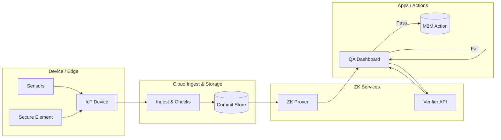

# zkIoT Project 

## Overview
zkIoT is a framework that enables IoT devices to prove compliance with rules or thresholds **without revealing raw sensor data**. By applying Zero-Knowledge Proofs (ZKP) to physical sensor outputs, industries can unlock trust and data usability while protecting privacy, trade secrets, and operational know-how.

## Problem
- **Data exposure risk:** Over **70% of IoT data leaks** involve sensitive operational or personal details, discouraging adoption in critical sectors.
- **Economic impact:** Global IoT data breaches are projected to cost industries more than **$500B annually** by 2030, with healthcare and energy as the most affected.
- **Adoption barrier:** Surveys indicate that **60% of enterprises delay IoT rollouts** due to privacy, liability, and IP protection concerns, limiting innovation in trillion-dollar markets.

## Solution
zkIoT bridges physical sensors and blockchain verification through:
1. **Zero-Knowledge Proofs** – Devices prove compliance ("temperature within 2–8°C", "energy ≤ X kWh") without revealing raw logs.
2. **Secure IoT Device Layer** – Hardware-secured IDs and signed data ensure authenticity of sensor input.
3. **Trusted Communication** – TLS/MQTT pipelines commit encrypted sensor data, while only ZK proofs flow on-chain.

## Usecase 
- Under-collateralized Industrial Lending × IoT Production Proof.
- IoT-based Whitelisting for EV Charging & Smart Mobility.
- Selective Disclosure in Pharma Cold Chain Compliance.

## Technologies I used

## Architecture

## Implementation Status

| Title          |                                                              URL |
| :------------- | ---------------------------------------------------------------: |
| Demo Movie      |                                      [zkiot-demo](https://youtu.be/WDGJQbM-rik)|
| Pitch Doc    |   [zkiot-presentation](https://www.canva.com/design/DAGxszg1ejA/_BAAG-tUr6_MTcjdlD_zBA/edit?utm_content=DAGxszg1ejA&utm_campaign=designshare&utm_medium=link2&utm_source=sharebutton) |
| Demo Site     |                                 [zkiot-demo](https://zkiot-frontend-intro.vercel.app/) | 

## What's next for
- Toward a society where **IoT devices trust each other** and can **connect autonomously**.
- Verified devices interact through **smart contracts**, enabling machine-to-machine (M2M) transactions.
- Example: smart meters settling energy trades, logistics sensors triggering insurance payouts, EVs paying for charging—all without exposing raw data.
- Supported by ongoing academic research in **trusted IoT networks**, **ZK-based attestations**, and **machine economy protocols**.

## Contracts　
**Verifier Contract**
| contract                   |                                                                                                                   contract address |
| :------------------------- | ---------------------------------------------------------------------------------------------------------------------------------: |
| Ethereum Sepolia    | [0x25Fb97F93B20701D382Fe9383Dee9Af5d0739618](https://etherscan.io/address/0x25fb97f93b20701d382fe9383dee9af5d0739618)|
| JSC Kaigan Testnet    | [0x1440a247071edde7e1016b18126163d805f98c31](https://explorer.kaigan.jsc.dev/address/0x1440A247071EDdE7e1016b18126163D805f98C31)|

**NFT Contract**
| contract                   |                                                                                                                   contract address |
| :------------------------- | ---------------------------------------------------------------------------------------------------------------------------------: |
| Ethereum Sepolia    | [0x0bf0c1505731a14282f325d964321e86426ac492](https://etherscan.io/address/0x0bf0c1505731a14282f325d964321e86426ac492)|
| JSC Kaigan Testnet    | [0xe2a548dacdbc942d659a523fd40335000c80064c](https://explorer.kaigan.jsc.dev/address/0xe2a548DaCdBC942D659a523FD40335000C80064c)|

**Verifier Contract**
| contract                   |                                                                                                                   contract address |
| :------------------------- | ---------------------------------------------------------------------------------------------------------------------------------: |
| Ethereum Sepolia    | [0x25Fb97F93B20701D382Fe9383Dee9Af5d0739618](https://etherscan.io/address/0x25fb97f93b20701d382fe9383dee9af5d0739618)|
| JSC Kaigan Testnet    | [0x1440a247071edde7e1016b18126163d805f98c31](https://explorer.kaigan.jsc.dev/address/0x1440A247071EDdE7e1016b18126163D805f98C31)|

## References　
- https://docs.circom.io/getting-started/installation
- https://docs.elizaos.ai/
- https://core2-for-aws-docs.m5stack.com/en/
